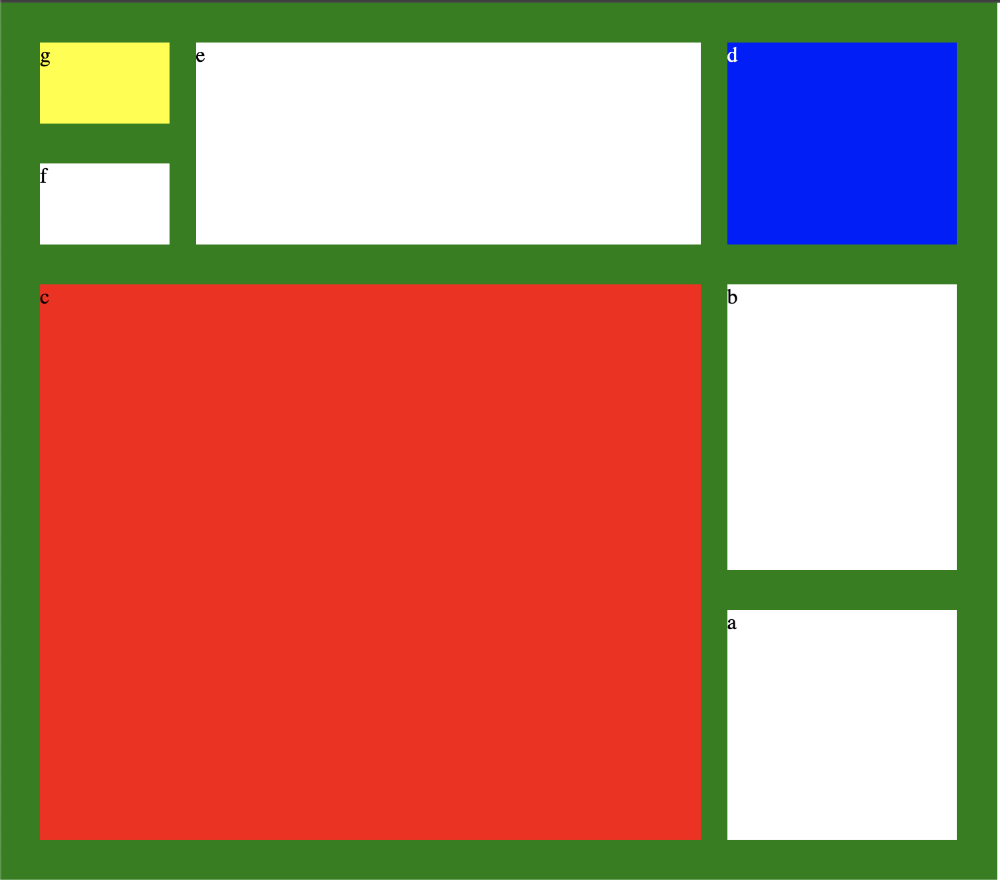

# CSS Grid Layout

This project is a great example of CSS Grid Layout and Media Queries, inspired by Jen Kramer’s course on Frontend Master. It showcases how these techniques can be used to create responsive and visually appealing layouts in web design.

## Visual Design

Below are visual representations of the webpage across different devices:

### Desktop

### Tablet

### Mobile

## Features

- Responsive design utilizing CSS Grid and Media Queries
- Clean and modern layout
- Adaptation to different screen sizes

## Getting Started

To view the webpage locally, follow these steps:

1. Clone the repository or download the project files.
2. Open the `index.html` file in your web browser.
3. Explore the layout and design!

## Technologies Used

- HTML5
- CSS3 (Grid, Media Queries)

## Acknowledgments

- Special thanks to Jen Kramer for the insightful course that inspired this project.
