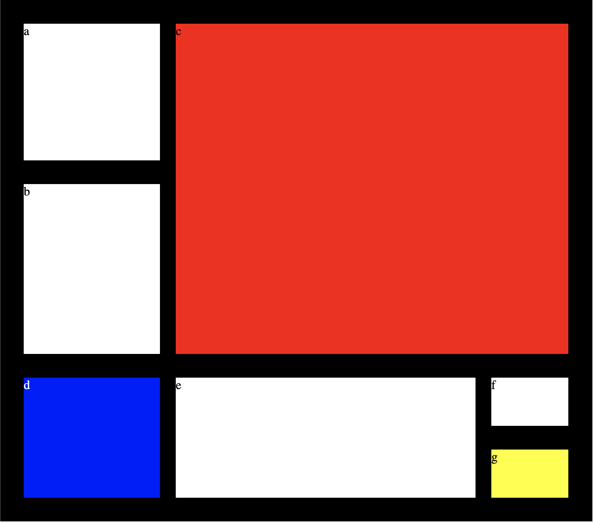

# CSS Grid Layout

This project is a great example of CSS Grid Layout and Media Queries, inspired by Jen Kramer’s course on Frontend Master. It showcases how these techniques can be used to create responsive and visually appealing layouts in web design.

## Visual Design

Below are visual representations of the webpage across different devices:

### Desktop



## Features

- Responsive design utilizing CSS Grid and Media Queries
- Clean and modern layout
- Adaptation to different screen sizes

## Getting Started

To view the website locally, follow these steps:

1. Clone the repository or download the files.

```
git clone https://github.com/BhoomiGohil/Grid-LayoutUI-2.git
cd Grid-LayoutUI-2
```

2. Open the `Index.html` file in your web browser.

```
open Index.html
```

OR

Using Live Server in Visual Studio Code:

1. **Install the Live Server extension:**
   Open Visual Studio Code Go to the Extensions view by clicking on the square icon on the left sidebar or pressing Ctrl+Shift+X Search for "Live Server" and click Install

2. Once installed, right-click on index.html and select "Open with Live Server".

This will open the project in your browser, and changes made to the code will be reflected automatically.

## Technologies Used

- HTML5
- CSS3 (Grid, Media Queries)

## Acknowledgments

- Special thanks to Jen Kramer for the insightful course that inspired this project.
